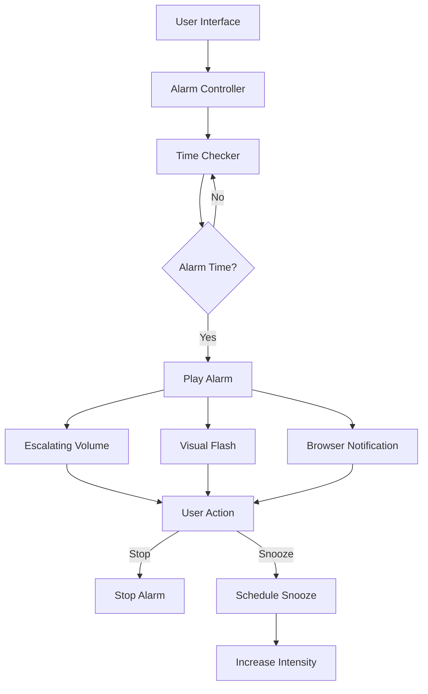

# Deep Sleeper Alarm System - Architecture Plan

## Overview
A web-based alarm system designed to wake deep sleepers with persistent, escalating alarm features.

## Core Features

### 1. Alarm Management
- Set multiple alarms with specific times
- Label alarms (e.g., "Work", "Weekend", "Important Meeting")
- Enable/disable individual alarms
- Delete alarms

### 2. Deep Sleeper Features
- **Escalating Volume**: Alarm volume increases every 30 seconds if not stopped
- **Multiple Sounds**: Random sound selection from a pool of alarm tones
- **Vibration Simulation**: Visual flashing/strobing effect (for devices without haptics)
- **Persistent Notifications**: Continuous browser notifications until acknowledged
- **Snooze with Consequences**: Each snooze makes the next alarm more intense

### 3. User Interface
- Clean, simple time picker
- List of active alarms
- Large, obvious stop/snooze buttons
- Visual feedback for alarm status

## Technical Architecture

## File Structure
- `index.html` - Main UI structure
- `script.js` - Alarm logic and time management
- `style.css` - Styling and visual effects
- `bonus.py` - Optional Python features (desktop notifications, system integration)

## Implementation Notes
- Use browser's Web Audio API for sound control
- Use localStorage for alarm persistence
- Use Notification API for system notifications
- Consider using Web Workers for background time checking

## Questions to Consider
1. Should this work offline or require internet?
Potentially both, lock some features behind a network connection and one works offline OR propose features that work better with and without network
2. Any specific alarm sounds you want to use?
not particularily, just something that should wake someone up, like Re:zero's return by death
3. Should there be a "challenge" to stop the alarm (math problems, etc)?
yes
4. Any mobile-specific features needed?
not particularily, but ideally.